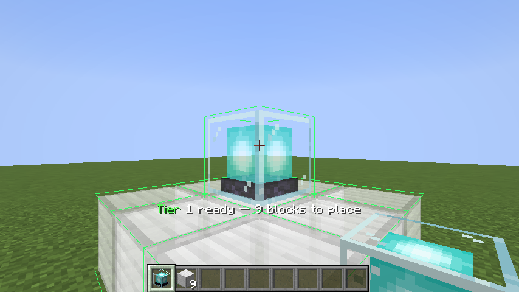
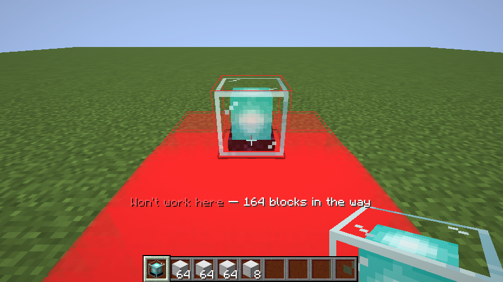
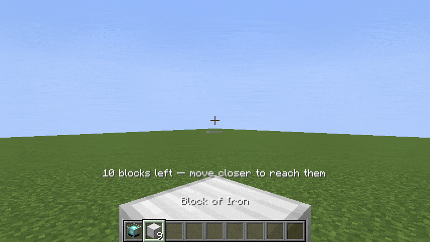
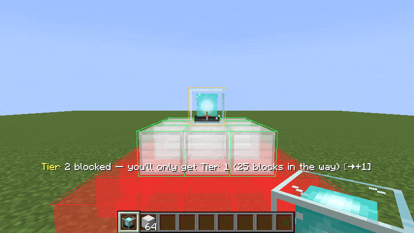

# Easy Beacon Placement

See the beacon pyramid before you build it. Then build it in one click.

Hold a beacon, hold <kbd>Left Alt</kbd>, and the pyramid you are about to build appears as a
colour-coded hologram — sized to the blocks you are actually carrying, with anything in the way
picked out in red. Right-click to build the whole thing.



**Minecraft 26.2** · Fabric · Quilt · NeoForge · Paper/Spigot

---

## What it does

**Shows you the real blocks.** The preview is a translucent ghost of the actual block that will be
placed — your iron, your netherite — not abstract markers.

**Sizes itself to your inventory.** It picks the largest tier you can complete (9 / 34 / 83 / 164
blocks for tiers 1–4). Blocks already correctly in place count towards it, so a half-built pyramid
gets finished rather than rebuilt.

**Shows obstructions through terrain.** Anything blocking the base is drawn in red and stays
visible inside solid ground, because it is almost always buried and the point is to show you what
to dig.



**Gives you a verdict, not a puzzle.** The beacon's own outline is green, amber or red for *will
reach this tier* / *will only manage a lower one* / *won't work*. A tier-4 footprint is 9×9 and
mostly off-screen — you should not have to inspect it by eye.

**Builds in one click**, verifying each placement against the world and retrying rather than firing
and forgetting.



**Modded base blocks work automatically** via the `#minecraft:beacon_base_blocks` block tag. The mod
knows nothing about specific blocks.

## Controls

| Key | Action |
| --- | --- |
| <kbd>Left Alt</kbd> (hold) | Show the hologram |
| Right-click | Build the previewed pyramid |
| <kbd>V</kbd> | Cycle the tier (auto → 1 → 2 → 3 → 4 → auto); cancels an in-progress build |
| Mouse wheel | Push the beacon along your line of sight |
| Sneak + wheel | Move the beacon up and down |

Both keys are rebindable in Options → Controls, under *Easy Beacon Placement*.

The wheel works when you are aiming at open sky too, not just at a block — so you can place a beacon
in mid-air and let the pyramid fill in below it.



## Installing

**The client half is the one you need.** Drop the jar for your loader into `mods/` along with
[Fabric API](https://modrinth.com/mod/fabric-api) on Fabric or Quilt. That is the whole setup, and
it works against vanilla, Paper, Spigot, Purpur and Folia servers with nothing installed on them.

**Installing server-side is optional and only removes the reach limit.** Without it the client
places every block through the ordinary vanilla interaction packet, so the server's own reach limit
applies and large pyramids need you to walk around. With it, the server places the structure
directly and that limit disappears. Singleplayer gets this automatically.

| Server | What to install |
| --- | --- |
| Fabric / Quilt | the same `-fabric` jar, in the server's `mods/` |
| NeoForge | the same `-neoforge` jar, in the server's `mods/` |
| Paper / Spigot | the `-paper` jar, in `plugins/` |

Server-side placement grants nothing you could not do by hand. The beacon must still be in your
hand, blocks are still consumed from your inventory, and world height, world border, chunk loading
and spawn protection are all enforced. On Paper and NeoForge each block is offered to the server's
own block-place event, so WorldGuard, GriefPrevention and similar can veto individual positions —
anything refused is refunded.

> [!NOTE]
> This is an auto-build mod, the same category as Litematica's printer or building wands. Some
> servers forbid client-side automation regardless of how ordinary the packets look. Check your
> server's rules.

## Configuration

Written to `config/easy_beacon_placement.json` on first launch. Colours are `#AARRGGBB`, or
`#RRGGBB` for fully opaque.

| Option | Default | What it does |
| --- | --- | --- |
| `maxInFlight` | `4` | Placements awaiting server confirmation at once. `1` builds strictly one block at a time. Keep it small — a large backlog of unacknowledged predictions is what leaves holes. |
| `preferServerPlacement` | `true` | Let the server build when it has the mod. Turn off to always place client-side, exactly as players without it experience. |
| `maxTier` | `4` | Upper bound on the previewed tier (1–4). |
| `countHotbarOnly` | `false` | Ignore your backpack when picking a tier. Forced on whenever the client is doing the placing, since it can only use a hand. |
| `obstructionsThroughWalls` | `true` | Draw blockers through solid terrain. |
| `airPreviewDistance` | `4.0` | How far ahead the beacon sits when you aim at open sky. |
| `maxScrollOffset` | `16` | How far the wheel can nudge the beacon. |
| `invertScroll` | `false` | Flip the wheel direction. |
| `ghostOpacity` | `0.72` | How solid the ghost blocks look (0–1). |
| `drawOutlines` | `true` | Wireframe outline around each previewed block. |
| `showStatusText` | `true` | Status line above the hotbar. |
| `boxInset` | `0.03` | Shrink each box so neighbours stay separable. |
| `colorPlaceable` | `#FF33FF66` | Free space that will be filled. |
| `colorAlreadyValid` | `#20FFFFFF` | A correct block is already here. |
| `colorObstructed` | `#78FF2A2A` | Something is in the way. |
| `colorMissingMaterial` | `#40FFC53D` | Free space, but you are out of blocks. |

Out-of-range values are clamped and malformed colours are reported in the log and replaced, both
written back to the file. The file is also rewritten on load, so upgrading picks up new options
rather than leaving you to find them in the changelog.

## Building from source

Requires **JDK 25**.

```bash
./gradlew build
```

Jars land in `fabric/build/libs/`, `neoforge/build/libs/` and `paper/build/libs/`.

To run the end-to-end tests, which drive a real client and a real dedicated server:

```bash
./gradlew :fabric:runClientGameTest
```

### Project layout

`common/src/main/java` is a plain source directory, **not** a Gradle subproject. Both mod loaders
pull it in via `sourceSets.main.java.srcDir`, so each builds the shared code with its own native
toolchain and there is no cross-loader build plugin to break on a new Minecraft version.

This project deliberately does not use Architectury Loom: as of 1.17.491 it still hard-requires
official Mojang mappings, which no longer exist now that 26.x ships unobfuscated.

The Paper plugin shares nothing with the mod. Paper is not a mod loader — it is a fork of the
vanilla server exposing the Bukkit API — so it cannot see Minecraft's own classes. The only thing
the two sides share is the shape of the packet, pinned down in `PyramidGeometry`.

## Links

- [Changelog](CHANGELOG.md)
- [Modrinth page copy](docs/modrinth-description.md)

## License

[MIT](LICENSE).
